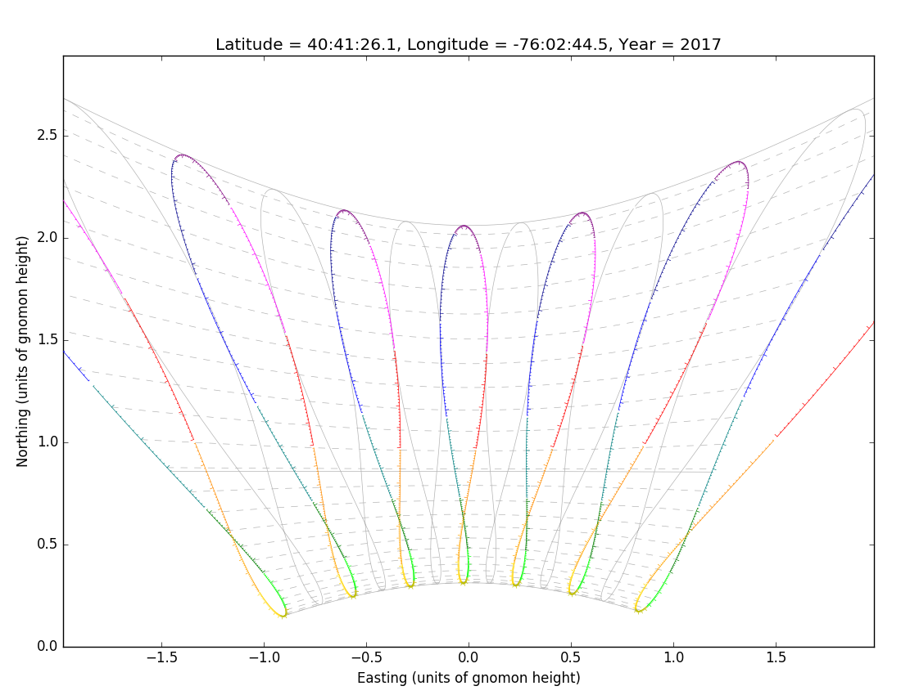

# sundial
Code for making sundial patterns, using pyephem

For very simple pyephem usage, see `simple.py`.  This gives the azimuth and
elevation of the sun, from a specific location (flag pole next to the Statue of
Liberty is given as an example) at a specific time.  The output is simple:
```
Date                                    (GMT) =  2017/7/4 13:00:00
Latitude            (degrees:minutes:seconds) =  40:41:26.1
Longitude           (degrees:minutes:seconds) =  -76:02:44.5
Elevation                            (meters) =  3.0
Azimuth of the sun  (degrees:minutes:seconds) =  89:02:58.4
Altitude of the sun (degrees:minutes:seconds) =  35:25:06.3
```

`sundial.py` is code that can be used for making sundial patterns, such as the
one below.  The figure 8s are analemmas, which show where the sun is at the same
time every day over the course of a year.  Different rainbow colored analemmas
correspond to different hours.  The path of the sun every day is in
the direction of the dashed gray lines. 

Different locations on the Earth have different patterns.  The plot below is for
the location of the flag pole near the Statue of Liberty.

